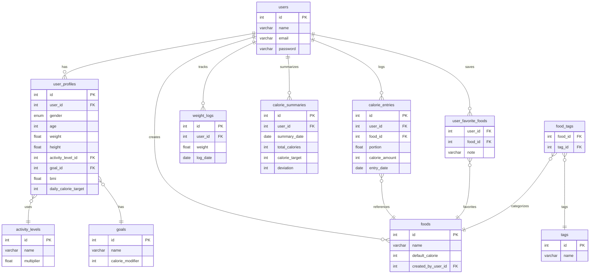

# 🥗 KaloriKu - Your Simple Calorie Pal

<div align="center">


**Aplikasi pencatat kalori sederhana untuk masyarakat Indonesia**

[](https://laravel.com)
[](https://reactjs.org)
[](https://docker.com)
[](https://mysql.com)
[](LICENSE)

[Demo](https://kaloriku-demo.com) • [Documentation](./DOCKER.md) • [Report Bug](https://github.com/username/kaloriku/issues) • [Request Feature](https://github.com/username/kaloriku/issues)

</div>

**Versi:** 1.0 (MVP)  
**Tanggal Rilis:** 6 Juli 2025  
**Status:** 🚧 Development Phase

---

## 📋 Table of Contents

- [🥗 KaloriKu - Your Simple Calorie Pal](#-kaloriku---your-simple-calorie-pal)
  - [📋 Table of Contents](#-table-of-contents)
  - [❓ Why - Latar Belakang Masalah](#-why---latar-belakang-masalah)
  - [✅ Solusi: KaloriKu](#-solusi-kaloriku)
  - [🎯 Visi Produk](#-visi-produk)
  - [🧑‍💻 Target Pengguna](#-target-pengguna)
  - [🧩 Fitur Utama (MVP)](#-fitur-utama-mvp)
  - [🛠️ Teknologi](#️-teknologi)
  - [🧱 Struktur Database (ERD)](#-struktur-database-erd)
  - [🐳 Docker Setup \& Deployment](#-docker-setup--deployment)
    - [🚀 Quick Start](#-quick-start)
      - [**Development Environment**](#development-environment)
      - [**Production Environment**](#production-environment)
    - [🏗️ Services Architecture](#️-services-architecture)
    - [📋 Environment Profiles](#-environment-profiles)
    - [🔧 Manual Commands](#-manual-commands)
    - [📖 Documentation](#-documentation)
  - [💻 Local Development (Non-Docker)](#-local-development-non-docker)
    - [Prerequisites](#prerequisites)
    - [Setup Steps](#setup-steps)
  - [🎯 Development Workflow](#-development-workflow)
    - [Branch Strategy](#branch-strategy)
    - [Code Quality](#code-quality)
    - [Team Collaboration](#team-collaboration)
  - [🚀 Deployment](#-deployment)
    - [Production Deployment](#production-deployment)
    - [Environment Variables](#environment-variables)
  - [📊 Monitoring \& Maintenance](#-monitoring--maintenance)
    - [Health Checks](#health-checks)
    - [Backup](#backup)
  - [👥 Tim Pengembang](#-tim-pengembang)
    - [Development Team](#development-team)
    - [Kontribusi \& Acknowledgments](#kontribusi--acknowledgments)
  - [📈 Roadmap \& Future Features](#-roadmap--future-features)
    - [Phase 2 (Post-MVP)](#phase-2-post-mvp)
    - [Phase 3 (Advanced)](#phase-3-advanced)
    - [Technical Improvements](#technical-improvements)
  - [🤝 Contributing](#-contributing)
    - [Development Setup](#development-setup)
    - [Contribution Guidelines](#contribution-guidelines)
  - [📄 License](#-license)
  - [📞 Support \& Contact](#-support--contact)
    - [Technical Issues](#technical-issues)
    - [Business Inquiries](#business-inquiries)
    - [Community](#community)
  - [🙏 Special Thanks](#-special-thanks)

---

## ❓ Why - Latar Belakang Masalah

Tingkat obesitas di Indonesia terus meningkat — menurut Riskesdas 2018, **1 dari 5 orang dewasa mengalami obesitas**, yang menjadi pintu gerbang ke berbagai penyakit kronis seperti:
- Diabetes
- Hipertensi
- Penyakit jantung

Meskipun kesadaran hidup sehat makin tinggi, banyak orang **gagal membangun kebiasaan mencatat kalori** karena aplikasi yang tersedia:
- Terlalu rumit
- Tidak relevan dengan makanan lokal
- Menuntut input data berlebihan
- Membosankan karena repetitif

---

## ✅ Solusi: KaloriKu

KaloriKu hadir sebagai aplikasi web pencatat kalori **yang sangat sederhana dan cepat digunakan**, khususnya bagi masyarakat Indonesia.  
Dirancang untuk menjadi **teman kalori pertama** yang ringan, intuitif, dan relevan.

> Fokus KaloriKu: **“Simple > Complete”**, karena pengguna pemula butuh solusi mudah terlebih dahulu sebelum komitmen jangka panjang.

---

## 🎯 Visi Produk

> Menjadi aplikasi pencatat kalori harian **yang paling cepat dan tidak merepotkan**, khususnya bagi masyarakat Indonesia.

---

## 🧑‍💻 Target Pengguna

- **Individu Sibuk:** Profesional, mahasiswa, orang tua yang tidak sempat mencatat detail makanan.
- **Pemula Diet:** Butuh pengalaman pertama yang positif dan tidak mengintimidasi.
- **Penjaga Berat Badan:** Hanya ingin alat pantau yang simpel dan cepat.

---

## 🧩 Fitur Utama (MVP)

| Prioritas | Fitur | Deskripsi |
|----------|-------|-----------|
| Wajib | 🔐 Pendaftaran & Login | Autentikasi pengguna menggunakan email & password. |
| Wajib | 🧍‍♂️ Setup Profil | Input data diri: gender, usia, berat, tinggi, aktivitas → kalkulasi BMI & target kalori. |
| Wajib | ✍️ Pencatatan Manual | Input makanan & kalori secara cepat setiap hari. |
| Wajib | 📊 Dashboard Harian | Lihat total kalori masuk vs. target dengan visual jelas (progress bar). |
| Penting | 📆 Riwayat Kalori | Ringkasan 7 hari terakhir dalam bentuk daftar atau grafik. |
| Penting | ❤️ Makanan Favorit | Simpan makanan yang sering dimakan agar bisa input 1 klik. |

---

## 🛠️ Teknologi

- **Backend:** Laravel (PHP 8.2)
- **Frontend:** React.js (via Inertia.js + Vite)
- **Database:** MySQL 8.0
- **Cache & Session:** Redis 7
- **Web Server:** Nginx
- **Containerization:** Docker & Docker Compose
- **Arsitektur:** Monolithic App dengan Microservices-ready infrastructure

---

## 🧱 Struktur Database (ERD)

Diagram berikut merepresentasikan struktur database utama menggunakan **Mermaid.js**:



---

## 🐳 Docker Setup & Deployment

KaloriKu dilengkapi dengan Docker containerization yang lengkap untuk development dan production environment.

### 🚀 Quick Start

#### **Development Environment**
```bash
# Clone repository
git clone [repository-url]
cd kaloriKu

# Start development environment (termasuk hot reload)
./start-dev.sh

# Akses aplikasi di:
# - App: http://localhost:8001
# - Vite HMR: http://localhost:5173
# - phpMyAdmin: http://localhost:8080
# - Redis Commander: http://localhost:8081
```

#### **Production Environment**
```bash
# Start production environment
./start-prod.sh

# Akses aplikasi di:
# - App: http://localhost:8000
# - App (Nginx): http://localhost
```

### 🏗️ Services Architecture

| Service | Purpose | Development Port | Production Port |
|---------|---------|------------------|-----------------|
| **app** | Laravel application | - | 8000 |
| **app-dev** | Laravel + hot reload | 8001, 5173 | - |
| **mysql** | Database server | 3306 | 3306 |
| **redis** | Cache & sessions | 6379 | 6379 |
| **nginx** | Load balancer | - | 80, 443 |
| **queue** | Background jobs | - | - |
| **scheduler** | Cron tasks | - | - |
| **phpmyadmin** | DB management | 8080 | - |
| **redis-commander** | Redis management | 8081 | - |

### 📋 Environment Profiles

- **`dev`**: Development dengan hot reload dan debugging tools
- **`tools`**: Database dan Redis management interfaces
- **`production`**: Optimized untuk deployment dengan load balancer

### 🔧 Manual Commands

```bash
# Development
docker-compose --profile dev --profile tools up -d

# Production
docker-compose --profile production up --build -d

# View logs
docker-compose logs -f app-dev  # Development
docker-compose logs -f app      # Production

# Execute artisan commands
docker-compose exec app-dev php artisan migrate
docker-compose exec app-dev php artisan tinker

# Stop services
docker-compose down
```

### 📖 Documentation

Lihat **[DOCKER.md](./DOCKER.md)** untuk dokumentasi lengkap tentang:
- Detailed setup instructions
- Troubleshooting guide
- Performance monitoring
- Configuration options

---

## 💻 Local Development (Non-Docker)

Jika prefer setup lokal tanpa Docker:

### Prerequisites
- PHP 8.2+
- Node.js 20+
- MySQL 8.0+
- Composer
- Git

### Setup Steps
```bash
# Clone repository
git clone [repository-url]
cd kaloriKu

# Install dependencies
composer install
npm install

# Setup environment
cp .env.example .env
php artisan key:generate

# Configure database di .env file
php artisan migrate --seed

# Start servers
php artisan serve    # Terminal 1
npm run dev         # Terminal 2
```

---

## 🎯 Development Workflow

### Branch Strategy
- **`main`**: Production-ready code
- **`develop`**: Integration branch
- **`feature/*`**: Feature development

### Code Quality
```bash
# PHP Code Style
./vendor/bin/pint

# Run tests
php artisan test

# Build production assets
npm run build
```

### Team Collaboration
1. Use Docker development environment untuk consistency
2. Commit dengan conventional commits format
3. Create PR ke `develop` branch
4. Deploy dari `main` branch

---

## 🚀 Deployment

### Production Deployment
```bash
# Update code
git pull origin main

# Deploy dengan Docker
./start-prod.sh

# Atau manual
docker-compose --profile production up --build -d
```

### Environment Variables
Sesuaikan file `.env.docker` untuk production:
```env
APP_ENV=production
APP_DEBUG=false
APP_URL=https://your-domain.com
DB_HOST=mysql
REDIS_HOST=redis
```

---

## 📊 Monitoring & Maintenance

### Health Checks
```bash
# Container status
docker-compose ps

# Resource usage
docker stats

# Application logs
docker-compose logs -f app
```

### Backup
```bash
# Database backup
docker-compose exec mysql mysqldump -u kaloriku -psecret123 kaloriku > backup.sql

# Redis backup
docker-compose exec redis redis-cli --rdb /data/dump.rdb
```

---

## 👥 Tim Pengembang

KaloriKu dikembangkan sebagai **proyek UAS Kelompok** dengan pembagian role sebagai berikut:

### Development Team
- **Technical Lead & Full-Stack Developer**: [Nama Anda]
  - Backend development (Laravel)
  - Frontend development (React.js)
  - Database design & implementation
  - Docker containerization
  - System architecture

- **Content & Design Specialist**: [Nama Teammate 1]
  - UI/UX copywriting
  - Visual assets creation
  - User experience optimization
  - Marketing materials

- **Research & Documentation Specialist**: [Nama Teammate 2]
  - Market research & competitor analysis
  - User persona development
  - Project documentation
  - Business model planning

### Kontribusi & Acknowledgments
- Terima kasih kepada komunitas Laravel dan React.js
- Special thanks untuk Docker community
- Inspirasi dari aplikasi-aplikasi health tracking terbaik

---

## 📈 Roadmap & Future Features

### Phase 2 (Post-MVP)
- [ ] **Database Makanan Lokal**: Integrasi database makanan Indonesia
- [ ] **Barcode Scanner**: Scan barcode untuk input makanan cepat
- [ ] **Social Features**: Share progress dengan teman
- [ ] **Gamifikasi**: Achievement dan streak system

### Phase 3 (Advanced)
- [ ] **AI Recommendations**: Saran makanan berbasis AI
- [ ] **Nutrition Tracking**: Track protein, carbs, fat detail
- [ ] **Integration**: Sync dengan fitness apps
- [ ] **Mobile App**: Native iOS/Android app

### Technical Improvements
- [ ] **Microservices**: Migration ke microservices architecture
- [ ] **PWA**: Progressive Web App support
- [ ] **Performance**: Advanced caching dan optimization
- [ ] **Analytics**: User behavior tracking dan insights

---

## 🤝 Contributing

Ingin berkontribusi ke KaloriKu? Kami sangat welcome!

### Development Setup
1. Fork repository ini
2. Setup development environment dengan Docker: `./start-dev.sh`
3. Buat feature branch: `git checkout -b feature/amazing-feature`
4. Commit changes: `git commit -m 'Add amazing feature'`
5. Push ke branch: `git push origin feature/amazing-feature`
6. Submit Pull Request

### Contribution Guidelines
- Follow PSR-12 coding standards untuk PHP
- Use ESLint dan Prettier untuk JavaScript/React
- Write tests untuk new features
- Update documentation jika diperlukan

---

## 📄 License

Project ini menggunakan **MIT License** - lihat file [LICENSE](LICENSE) untuk detail.

---

## 📞 Support & Contact

### Technical Issues
- Create issue di GitHub repository
- Email: dev@kaloriku.com

### Business Inquiries
- Email: hello@kaloriku.com
- LinkedIn: [KaloriKu Official]

### Community
- Discord: [KaloriKu Community Server]
- Facebook Group: [KaloriKu Indonesia]

---

## 🙏 Special Thanks

Terima kasih kepada:
- **Universitas/Institusi** untuk support project ini
- **Dosen Pembimbing** untuk guidance dan feedback
- **Alpha/Beta Testers** untuk early feedback
- **Open Source Community** untuk amazing tools dan libraries

---

<div align="center">

**Made with ❤️ in Indonesia**

[Website](https://kaloriku.com) • [GitHub](https://github.com/username/kaloriku) • [Documentation](./DOCKER.md)

</div>
